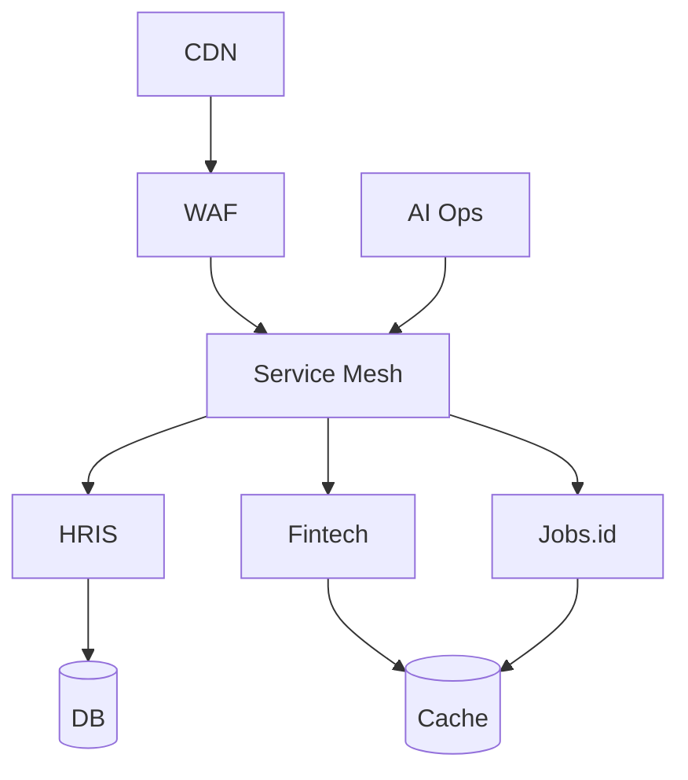

<div align="center">


<a href="https://git.io/typing-svg">
  
</a>

<br/><br/>

[](https://linkedin.com/in/mnurfaqi)
[](mailto:m.nurfaqi@byru.id)
[](https://byru.id)
[](https://github.com/mnf94)

</div>

---

## 🛰️ Command Center: 2026 Telemetry

> **Mission Objective:** Orchestrating 5 high-availability product entities under a unified, AI-augmented infrastructure with a zero-trust security posture.

<div align="center">

| 🏗️ Architecture   | 🛡️ Security     | 🧠 AI Ops          |
| :----------------- | :--------------- | :----------------- |
| 5 Entities, 1 Core | Zero-Trust Model | LLM Pipelines      |
| 99.99% SLA Target  | OWASP Alignment  | +40% Velocity      |
| Hybrid Data Vault  | HSM Encryption   | Predictive Scaling |

</div>

---

## 🧬 System Topology

<details>
<summary><b>Expand Diagram</b></summary>



</details>

---

## 🚀 Product Ecosystem

| Product       | Role      | Focus          |
| :------------ | :-------- | :------------- |
| Byru HRIS     | Architect | Workforce SaaS |
| Finfleet      | Tech Lead | Payment Infra  |
| Byru Security | Security  | Hardening      |
| Jobs.id       | Product   | Integration    |
| e-mobi.id     | Mobile    | Access Layer   |

---

## 📊 Global Metrics

<div align="center">


</div>

<br>

<div align="center">


</div>

---

## 📈 Activity

<div align="center">


</div>

<br>

<div align="center">


</div>

<br>

<div align="center">


</div>

---

## 🧪 R&D Pipeline

```yaml
AI:
  - autonomous debugging
  - self-healing systems

Security:
  - SQLi remediation
  - zero-trust rollout

Fintech:
  - EWA pipeline
  - banking integration

Scaling:
  - multi-tenant optimization
  - cross-product funnel
```

---

## ⚖️ Philosophy

> Systems must scale, self-heal, and never block innovation.

---

## 🤝 Contact

<div align="center">

[LinkedIn](https://linkedin.com/in/mnurfaqi) •
[Email](mailto:m.nurfaqi@byru.id) •
[Website](https://byru.id)

</div>

<div align="center">

</div>
