<div align="center">


### ⚡ Bridging the Gap Between Legacy Finance & Autonomous AI Ecosystems

[](https://linkedin.com/in/mnurfaqi)
[](mailto:m.nurfaqi@byru.id)
[](https://byru.id)

</div>

---

## 💎 Executive Dashboard (Core Metrics 2026)

| 🏗️ Architecture | 🛡️ Security & Compliance | 🤖 AI Intelligence |
| :--- | :--- | :--- |
| **Scale:** 1M+ Active Transactions | **Standard:** Zero-Trust Model | **Engine:** LLM-Driven DevOps |
| **Uptime:** 99.99% SLA Target | **Defense:** AI-Threat Hunting | **Efficiency:** 40% Auto-Remediation |

---

## 🏗️ System Architecture (Next-Gen Stack)

```mermaid
graph TD
    subgraph User_Edge [Global Client Access]
        A[Mobile/Web Apps] --> B[Anycast CDN]
        B --> C{Global Load Balancer}
    end

    subgraph Core_Engine [The Distributed Backbone]
        C --> D[Micro-Frontends]
        D --> E[Service Mesh / Istio]
        E --> F[Fintech API Core]
        E --> G[HRIS Logic Unit]
    end

    subgraph AI_Autopilot [AI Ops Layer 2026]
        H[Real-time Telemetry] --> I[Self-Healing Agent]
        I -->|Auto-Patch| E
        I -->|Scaling| J[(Cloud Infrastructure)]
    end

    subgraph Data_Vault [Secure Storage]
        F --> K[(Postgres Cluster)]
        G --> K
        K --- L[Hardware Security Module]
    end

    style AI_Autopilot fill:#0f172a,stroke:#38bdf8,stroke-width:2px
    style Data_Vault fill:#1e3a8a,stroke:#60a5fa,stroke-width:2px
```



---

## 🏢 Ecosystem & Strategic Impact

| Platform | Role | Strategic Value | 2026 Tech Milestone |
| :--- | :--- | :--- | :--- |
| **Byru HRIS** | Core SaaS | Workforce Intelligence | Multi-region High Availability |
| **Finfleet** | Fintech | EWA & Payments | ISO 20022 Compliance |
| **Byru Security** | Security | Audit & Protection | AI-Driven Vulnerability Scanning |
| **Jobs.id** | Marketplace | Talent Distribution | Vector Database Semantic Search |

---

## ⚡ Tech Stack & Hyper-Specialization

* **Languages:** `PHP (Laravel)`, `Rust (Performance)`, `Node.js`, `Python (AI Ops)`, `Go`
* **Databases:** `PostgreSQL`, `Vector DB (Milvus/Pinecone)`, `Redis`, `SQL Server`
* **Infrastructure:** `Kubernetes`, `Docker`, `Terraform`, `Nginx`, `Cloudflare`
* **AI/ML:** `LangChain`, `Ollama (Edge AI)`, `PyTorch`, `Autonomous Agents`

---

## 📊 Engineering Velocity & Metrics

<div align="center">
  
  
</div>

---

## 🧪 Current Work & R&D

```yaml
AI_Operations:
  - Autonomous debugging pipeline
  - LLM-assisted DevOps automation

Cyber_Resilience:
  - Multi-tenant hardening (Zero-Trust)
  - Predictive threat modeling

Fintech_Infrastructure:
  - EWA scalable architecture
  - Seamless Bank API integrations

Scale_Engineering:
  - HRIS high-concurrency optimization
  - Global database sharding
```

---

## 📈 Contribution Graph

<div align="center">
  
</div>

---

## 🧭 Leadership Philosophy

> "Systems should scale quietly, recover automatically, and never become the bottleneck to business innovation."

---

<div align="center">

</div>
