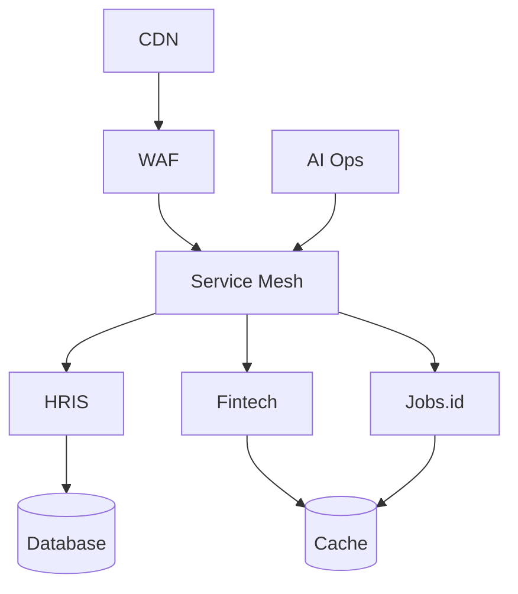

<div align="center">


<a href="https://git.io/typing-svg">
  
</a>

<br/><br/>

[](https://linkedin.com/in/mnurfaqi)
[](mailto:m.nurfaqi@byru.id)
[](https://byru.id)
[](https://github.com/mnf94)

</div>

---

## About Me

I'm **VP & Director of IT at PT Solusi Kerah Byru**, where I own the technology strategy and execution behind a portfolio of interconnected products spanning **HR tech, fintech, and workforce infrastructure**. My mandate covers architecture, security, and platform reliability across every product line — translating business objectives into systems that scale without slowing the organization down.

I lead with a builder's mindset: hands-on in architecture reviews and incident response, not just steering from a distance. My focus areas:

- **Platform architecture** — multi-tenant SaaS serving multiple business units on a shared, hardened core
- **Security posture** — zero-trust design, OWASP-aligned practices, and encryption at rest/in transit across all services
- **AI-augmented operations** — applying LLM-driven tooling to accelerate engineering velocity and reduce operational toil
- **Technical leadership** — building and mentoring engineering teams that own outcomes, not just tickets

---

## Leadership Impact

<div align="center">

| Domain | Highlight |
| :--- | :--- |
| 🏗️ **Architecture** | 5 product entities unified under one core platform, 99.99% SLA target |
| 🛡️ **Security** | Zero-trust rollout across all services, OWASP-aligned hardening |
| 🧠 **AI Operations** | LLM-driven pipelines contributing to a measurable increase in delivery velocity |
| 📈 **Scale** | Hybrid data architecture supporting multi-tenant growth without re-platforming |

</div>

---

## Product Portfolio

| Product | My Role | Focus |
| :--- | :--- | :--- |
| **Byru HRIS** | Architect | Workforce management SaaS |
| **Finfleet** | Tech Lead | Payment & fintech infrastructure |
| **Byru Security** | Security Owner | Platform hardening & compliance |
| **Jobs.id** | Product Oversight | Talent & job marketplace integration |
| **e-mobi.id** | Mobile Oversight | Access & mobility layer |

<details>
<summary><b>System topology (click to expand)</b></summary>



</details>

---

## Tech I Work With

<div align="center">


*(swap these for the stack you actually run day-to-day)*

</div>

---

## GitHub Activity

<div align="center">


<br/><br/>


<br/><br/>


</div>

---

## Currently Exploring

```yaml
AI:
  - autonomous debugging
  - self-healing systems

Security:
  - continuous vulnerability remediation
  - zero-trust rollout across remaining services

Fintech:
  - earned wage access (EWA) pipeline
  - banking integrations

Platform:
  - multi-tenant cost & performance optimization
  - cross-product data funnel
```

---

## Philosophy

> Systems must scale, self-heal, and never block innovation. Good architecture is invisible when it works — and the team's job is to make sure it always does.

---

<div align="center">

**Let's connect** — [LinkedIn](https://linkedin.com/in/mnurfaqi) • [Email](mailto:m.nurfaqi@byru.id) • [byru.id](https://byru.id)


</div>
